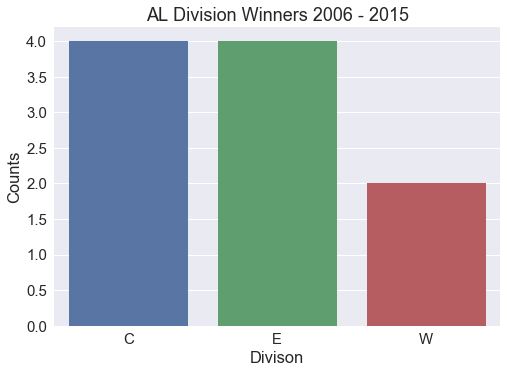
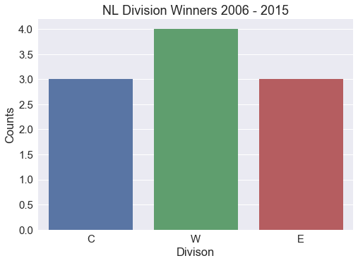
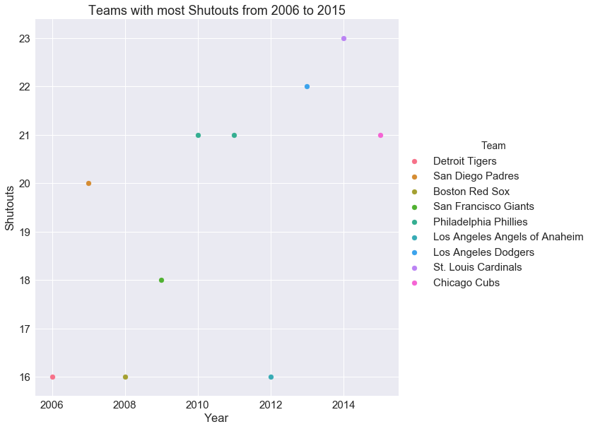

<h2>Introduction</h2>

Janice Luong and Sierra Tevlin analyzed the Lahman 2015 baseball data. We analyzed data from 2006 to 2016 because 2006 was the year after any names changes had happened (last name change was in 2005). We will primarily focus on the player’s and a little bit on team statistics (number of hits, pitches, etc...) so we can get an idea of how well a player and teams performs throughout the years and what kind of strategies are popular or successful among different teams.

<h2>Analyzing the Data</h2>

<h3>World Series Winners over the last 10 years</h3>

Here are the World Series Winners from 2006 to 2015 along with their number of runs:

<table border="1" class="dataframe">
  <thead>
    <tr style="text-align: right;">
      <th>Year</th>
      <th>Team</th>
      <th>Runs</th>
      <th>Total Hits</th>
    </tr>
  </thead>
  <tbody>
    <tr>
      <td>2006</td>
      <td>St. Louis Cardinals</td>
      <td>781</td>
      <td>1484</td>
    </tr>
    <tr>
      <td>2007</td>
      <td>Boston Red Sox</td>
      <td>867</td>
      <td>1561</td>
    </tr>
    <tr>
      <td>2008</td>
      <td>Philadelphia Phillies</td>
      <td>799</td>
      <td>1407</td>
    </tr>
    <tr>
      <td>2009</td>
      <td>New York Yankees</td>
      <td>915</td>
      <td>1604</td>
    </tr>
    <tr>
      <td>2010</td>
      <td>San Francisco Giants</td>
      <td>697</td>
      <td>1411</td>
    </tr>
    <tr>
      <td>2011</td>
      <td>St. Louis Cardinals</td>
      <td>762</td>
      <td>1513</td>
    </tr>
    <tr>
      <td>2012</td>
      <td>San Francisco Giants</td>
      <td>718</td>
      <td>1495</td>
    </tr>
    <tr>
      <td>2013</td>
      <td>Boston Red Sox</td>
      <td>853</td>
      <td>1566</td>
    </tr>
    <tr>
      <td>2014</td>
      <td>San Francisco Giants</td>
      <td>665</td>
      <td>1407</td>
    </tr>
    <tr>
      <td>2015</td>
      <td>Kansas City Royals</td>
      <td>724</td>
      <td>1497</td>
    </tr>
  </tbody>
</table>

The only team that has won three times in the last 10 years have been the San Francisco Giants. The St. Louis Cardinals and the Boston Red Sox have both won twice. And all of the other teams have won once. 

Major league baseball is broken down into two leagues: American and National. Each league is then broken down again into three divisions based on location: west, central, and east. The World Series is played between the two teams that win their respective league.

<h3>Who were the American League/National League winners for each year?</h3>

The American League winners were:

<table border="1" class="dataframe">
  <thead>
    <tr style="text-align: right;">
      <th>Year</th>
      <th>Team</th>
      <th>Division</th>
    </tr>
  </thead>
  <tbody>
    <tr>
      <td>2006</td>
      <td>Detroit Tigers</td>
      <td>C</td>
    </tr>
    <tr>
      <td>2007</td>
      <td>Boston Red Sox</td>
      <td>E</td>
    </tr>
    <tr>
      <td>2008</td>
      <td>Tampa Bay Rays</td>
      <td>E</td>
    </tr>
    <tr>
      <td>2009</td>
      <td>New York Yankees</td>
      <td>E</td>
    </tr>
    <tr>
      <td>2010</td>
      <td>Texas Rangers</td>
      <td>W</td>
    </tr>
    <tr>
      <td>2011</td>
      <td>Texas Rangers</td>
      <td>W</td>
    </tr>
    <tr>
      <td>2012</td>
      <td>Detroit Tigers</td>
      <td>C</td>
    </tr>
    <tr>
      <td>2013</td>
      <td>Boston Red Sox</td>
      <td>E</td>
    </tr>
    <tr>
      <td>2014</td>
      <td>Kansas City Royals</td>
      <td>C</td>
    </tr>
    <tr>
      <td>2015</td>
      <td>Kansas City Royals</td>
      <td>C</td>
    </tr>
  </tbody>
</table>

The National League winners were:

<table border="1" class="dataframe">
  <thead>
    <tr style="text-align: right;">
      <th>Year</th>
      <th>Team</th>
      <th>Division</th>
    </tr>
  </thead>
  <tbody>
    <tr>
      <td>2006</td>
      <td>St. Louis Cardinals</td>
      <td>C</td>
    </tr>
    <tr>
      <td>2007</td>
      <td>Colorado Rockies</td>
      <td>W</td>
    </tr>
    <tr>
      <td>2008</td>
      <td>Philadelphia Phillies</td>
      <td>E</td>
    </tr>
    <tr>
      <td>2009</td>
      <td>Philadelphia Phillies</td>
      <td>E</td>
    </tr>
    <tr>
      <td>2010</td>
      <td>San Francisco Giants</td>
      <td>W</td>
    </tr>
    <tr>
      <td>2011</td>
      <td>St. Louis Cardinals</td>
      <td>C</td>
    </tr>
    <tr>
      <td>2012</td>
      <td>San Francisco Giants</td>
      <td>W</td>
    </tr>
    <tr>
      <td>2013</td>
      <td>St. Louis Cardinals</td>
      <td>C</td>
    </tr>
    <tr>
      <td>2014</td>
      <td>San Francisco Giants</td>
      <td>W</td>
    </tr>
    <tr>
      <td>2015</td>
      <td>New York Mets</td>
      <td>E</td>
    </tr>
  </tbody>
</table>

In the above plots, it is shown that in the past 10 years, Central and East division teams have been the American League champions more often than the West division teams, with four wins each. On the other hand, the National League champion has been from the West division has won more than either the Central or East division teams, with four wins.

<h3>Which team had the most and least runs in each season?</h3>

Teams that have a strong offense tend to score a lot of runs. We expected the teams that had the most runs to win the World Series, or if not, to at least be playing in the world series. Comparing the information that we gathered in the previous questions against the table above, we can see that is often not true. Over the last ten years, the only time that the team with the most runs in a season was in 2009 when the New York Yankees beat the Philadelphia Phillies. 

Teams who had the most runs:

<table border="1" class="dataframe">
  <thead>
    <tr style="text-align: right;">
      <th>Team</th>
      <th>Year</th>
      <th>Runs</th>
    </tr>
  </thead>
  <tbody>
    <tr>
      <td>New York Yankees</td>
      <td>2006</td>
      <td>930</td>
    </tr>
    <tr>
      <td>New York Yankees</td>
      <td>2007</td>
      <td>968</td>
    </tr>
    <tr>
      <td>Texas Rangers</td>
      <td>2008</td>
      <td>901</td>
    </tr>
    <tr>
      <td>New York Yankees</td>
      <td>2009</td>
      <td>915</td>
    </tr>
    <tr>
      <td>New York Yankees</td>
      <td>2010</td>
      <td>859</td>
    </tr>
    <tr>
      <td>Boston Red Sox</td>
      <td>2011</td>
      <td>875</td>
    </tr>
    <tr>
      <td>Texas Rangers</td>
      <td>2012</td>
      <td>808</td>
    </tr>
    <tr>
      <td>Boston Red Sox</td>
      <td>2013</td>
      <td>853</td>
    </tr>
    <tr>
      <td>Los Angeles Angels of Anaheim</td>
      <td>2014</td>
      <td>773</td>
    </tr>
    <tr>
      <td>Toronto Blue Jays</td>
      <td>2015</td>
      <td>891</td>
    </tr>
  </tbody>
</table>

It is interesting to note though, that many of the teams that made the list of most number of runs in a season were on it multiple times. The only team that was only on the list once was the Milwaukee Brewers in 2007.

Teams who had the least runs:

<table border="1" class="dataframe">
  <thead>
    <tr style="text-align: right;">
      <th>Team</th>
      <th>Year</th>
      <th>Runs</th>
    </tr>
  </thead>
  <tbody>
    <tr>
      <td>Tampa Bay Devil Rays</td>
      <td>2006</td>
      <td>689</td>
    </tr>
    <tr>
      <td>Washington Nationals</td>
      <td>2007</td>
      <td>673</td>
    </tr>
    <tr>
      <td>San Diego Padres</td>
      <td>2008</td>
      <td>637</td>
    </tr>
    <tr>
      <td>Pittsburgh Pirates</td>
      <td>2009</td>
      <td>636</td>
    </tr>
    <tr>
      <td>Seattle Mariners</td>
      <td>2010</td>
      <td>513</td>
    </tr>
    <tr>
      <td>Seattle Mariners</td>
      <td>2011</td>
      <td>556</td>
    </tr>
    <tr>
      <td>Houston Astros</td>
      <td>2012</td>
      <td>583</td>
    </tr>
    <tr>
      <td>Miami Marlins</td>
      <td>2013</td>
      <td>513</td>
    </tr>
    <tr>
      <td>San Diego Padres</td>
      <td>2014</td>
      <td>535</td>
    </tr>
    <tr>
      <td>Atlanta Braves</td>
      <td>2015</td>
      <td>573</td>
    </tr>
  </tbody>
</table>

Our expectation that the World Series teams would have the most runs, turned out to be completely false. The 2012 World Series winner, the San Francisco Giants, had the LEAST number of runs in that season. In 2014, the Kansas City Royals played in the World Series but had the least number of runs that year. Over the last ten years, both of the teams mentioned above have had the least number of runs for multiple years. We assume that, since they are obviously not the worst teams, their strengths are found in other places, such as having a good pitcher. 

<h3>Which teams had the most amount of stolen bases for each season?</h3>

<table border="1" class="dataframe">
  <thead>
    <tr style="text-align: right;">
      <th>Year</th>
      <th>Team</th>
      <th># of Stolen Bases</th>
    </tr>
  </thead>
  <tbody>
    <tr>
      <td>2006</td>
      <td>Los Angeles Angels of Anaheim</td>
      <td>148</td>
    </tr>
    <tr>
      <td>2007</td>
      <td>New York Mets</td>
      <td>200</td>
    </tr>
    <tr>
      <td>2008</td>
      <td>Tampa Bay Rays</td>
      <td>142</td>
    </tr>
    <tr>
      <td>2009</td>
      <td>Tampa Bay Rays</td>
      <td>194</td>
    </tr>
    <tr>
      <td>2010</td>
      <td>Tampa Bay Rays</td>
      <td>172</td>
    </tr>
    <tr>
      <td>2011</td>
      <td>San Diego Padres</td>
      <td>170</td>
    </tr>
    <tr>
      <td>2012</td>
      <td>Milwaukee Brewers</td>
      <td>158</td>
    </tr>
    <tr>
      <td>2013</td>
      <td>Kansas City Royals</td>
      <td>153</td>
    </tr>
    <tr>
      <td>2014</td>
      <td>Kansas City Royals</td>
      <td>153</td>
    </tr>
    <tr>
      <td>2015</td>
      <td>Cincinnati Reds</td>
      <td>134</td>
    </tr>
  </tbody>
</table>

Another way to check if a team has good offense is by the number of bases they were able to steal. 

<h3>What team pitched the most strike outs for each season?</h3>

<table border="1" class="dataframe">
  <thead>
    <tr style="text-align: right;">
      <th>Year</th>
      <th>Team</th>
      <th># of Strike Outs</th>
    </tr>
  </thead>
  <tbody>
    <tr>
      <td>2006</td>
      <td>Chicago Cubs</td>
      <td>1250</td>
    </tr>
    <tr>
      <td>2007</td>
      <td>Chicago Cubs</td>
      <td>1211</td>
    </tr>
    <tr>
      <td>2008</td>
      <td>Chicago Cubs</td>
      <td>1264</td>
    </tr>
    <tr>
      <td>2009</td>
      <td>San Francisco Giants</td>
      <td>1302</td>
    </tr>
    <tr>
      <td>2010</td>
      <td>San Francisco Giants</td>
      <td>1331</td>
    </tr>
    <tr>
      <td>2011</td>
      <td>Atlanta Braves</td>
      <td>1332</td>
    </tr>
    <tr>
      <td>2012</td>
      <td>Milwaukee Brewers</td>
      <td>1402</td>
    </tr>
    <tr>
      <td>2013</td>
      <td>Detroit Tigers</td>
      <td>1428</td>
    </tr>
    <tr>
      <td>2014</td>
      <td>Cleveland Indians</td>
      <td>1450</td>
    </tr>
    <tr>
      <td>2015</td>
      <td>Chicago Cubs</td>
      <td>1431</td>
    </tr>
  </tbody>
</table>

<h3>Which teams had the most hits for each season?</h3>

<table border="1" class="dataframe">
  <thead>
    <tr style="text-align: right;">
      <th>Year</th>
      <th>Team</th>
      <th># of Hits</th>
    </tr>
  </thead>
  <tbody>
    <tr>
      <td>2006</td>
      <td>Minnesota Twins</td>
      <td>1608</td>
    </tr>
    <tr>
      <td>2007</td>
      <td>New York Yankees</td>
      <td>1656</td>
    </tr>
    <tr>
      <td>2008</td>
      <td>Texas Rangers</td>
      <td>1619</td>
    </tr>
    <tr>
      <td>2009</td>
      <td>Los Angeles Angels of Anaheim</td>
      <td>1604</td>
    </tr>
    <tr>
      <td>2010</td>
      <td>Texas Rangers</td>
      <td>1556</td>
    </tr>
    <tr>
      <td>2011</td>
      <td>Boston Red Sox</td>
      <td>1600</td>
    </tr>
    <tr>
      <td>2012</td>
      <td>Texas Rangers</td>
      <td>1526</td>
    </tr>
    <tr>
      <td>2013</td>
      <td>Detroit Tigers</td>
      <td>1625</td>
    </tr>
    <tr>
      <td>2014</td>
      <td>Detroit Tigers</td>
      <td>1557</td>
    </tr>
    <tr>
      <td>2015</td>
      <td>Detroit Tigers</td>
      <td>1515</td>
    </tr>
  </tbody>
</table>

<h3>What team pitched the most shutouts for each season?</h3>
​
<table border="1" class="dataframe">
  <thead>
    <tr style="text-align: right;">
      <th>Team</th>
      <th>Year</th>
      <th>Shutouts</th>
    </tr>
  </thead>
  <tbody>
    <tr>
      <td>Detroit Tigers</td>
      <td>2006</td>
      <td>16</td>
    </tr>
    <tr>
      <td>San Diego Padres</td>
      <td>2007</td>
      <td>20</td>
    </tr>
    <tr>
      <td>Boston Red Sox</td>
      <td>2008</td>
      <td>16</td>
    </tr>
    <tr>
      <td>San Francisco Giants</td>
      <td>2009</td>
      <td>18</td>
    </tr>
    <tr>
      <td>Philadelphia Phillies</td>
      <td>2010</td>
      <td>21</td>
    </tr>
    <tr>
      <td>Philadelphia Phillies</td>
      <td>2011</td>
      <td>21</td>
    </tr>
    <tr>
      <td>Los Angeles Angels of Anaheim</td>
      <td>2012</td>
      <td>16</td>
    </tr>
    <tr>
      <td>Los Angeles Dodgers</td>
      <td>2013</td>
      <td>22</td>
    </tr>
    <tr>
      <td>St. Louis Cardinals</td>
      <td>2014</td>
      <td>23</td>
    </tr>
    <tr>
      <td>Chicago Cubs</td>
      <td>2015</td>
      <td>21</td>
    </tr>
  </tbody>
</table>

Database downloaded from [jknecht baseball archive](https://github.com/jknecht/baseball-archive-sqlite/blob/master/lahman2015.sqlite)