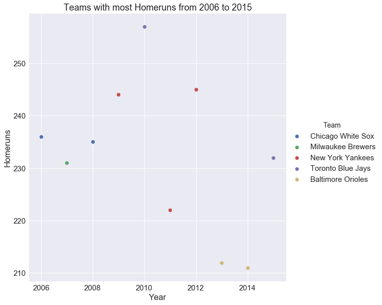
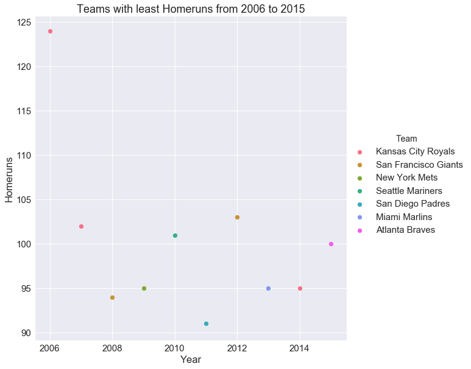
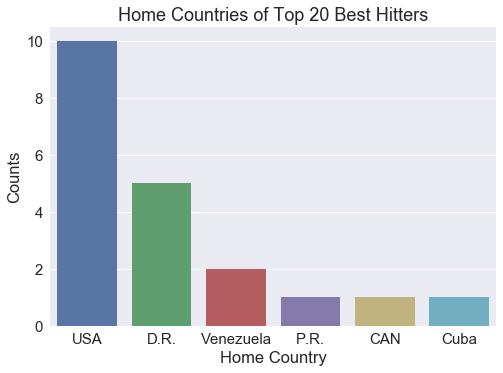

<h2>Introduction</h2>

Janice Luong and Sierra Tevlin analyzed the Lahman 2015 baseball data. We analyzed data from 2006 to 2016 because 2006 was the year after any names changes had happened (last name change was in 2005). We will primarily focus on the player’s and a little bit on team statistics (number of hits, pitches, etc...) so we can get an idea of how well a player and teams performs throughout the years and what kind of strategies are popular or successful among different teams.

<h2>Analyzing the Data</h2>

<h3>World Series Winners over the last 10 years</h3>

Here are the World Series Winners from 2006 to 2015 along with their number of runs and homeruns:

<table border="1" class="dataframe">
  <thead>
    <tr style="text-align: right;">
      <th>Team</th>
      <th>Runs</th>
      <th>Homeruns</th>
      <th>Year</th>
    </tr>
  </thead>
  <tbody>
    <tr>
      <td>St. Louis Cardinals</td>
      <td>781</td>
      <td>184</td>
      <td>2006</td>
    </tr>
    <tr>
      <td>Boston Red Sox</td>
      <td>867</td>
      <td>166</td>
      <td>2007</td>
    </tr>
    <tr>
      <td>Philadelphia Phillies</td>
      <td>799</td>
      <td>214</td>
      <td>2008</td>
    </tr>
    <tr>
      <td>New York Yankees</td>
      <td>915</td>
      <td>244</td>
      <td>2009</td>
    </tr>
    <tr>
      <td>San Francisco Giants</td>
      <td>697</td>
      <td>162</td>
      <td>2010</td>
    </tr>
    <tr>
      <td>St. Louis Cardinals</td>
      <td>762</td>
      <td>162</td>
      <td>2011</td>
    </tr>
    <tr>
      <td>San Francisco Giants</td>
      <td>718</td>
      <td>103</td>
      <td>2012</td>
    </tr>
    <tr>
      <td>Boston Red Sox</td>
      <td>853</td>
      <td>178</td>
      <td>2013</td>
    </tr>
    <tr>
      <td>San Francisco Giants</td>
      <td>665</td>
      <td>132</td>
      <td>2014</td>
    </tr>
    <tr>
      <td>Kansas City Royals</td>
      <td>724</td>
      <td>139</td>
      <td>2015</td>
    </tr>
  </tbody>
</table>

The only team that has won three times in the last 10 years have been the San Francisco Giants. The St. Louis Cardinals and the Boston Red Sox have both won twice. And all of the other teams have won once. 

Major league baseball is broken down into two leagues: American and National. Each league is then broken down again into three divisions based on location: west, central, and east. The World Series is played between the two teams that win their respective league.

<h3>Who were the American League/National League winners for each year?</h3>

The American League winners were:

<table border="1" class="dataframe">
  <thead>
    <tr style="text-align: right;">
      <th>Year</th>
      <th>Team</th>
      <th>Division</th>
    </tr>
  </thead>
  <tbody>
    <tr>
      <td>2006</td>
      <td>Detroit Tigers</td>
      <td>C</td>
    </tr>
    <tr>
      <td>2007</td>
      <td>Boston Red Sox</td>
      <td>E</td>
    </tr>
    <tr>
      <td>2008</td>
      <td>Tampa Bay Rays</td>
      <td>E</td>
    </tr>
    <tr>
      <td>2009</td>
      <td>New York Yankees</td>
      <td>E</td>
    </tr>
    <tr>
      <td>2010</td>
      <td>Texas Rangers</td>
      <td>W</td>
    </tr>
    <tr>
      <td>2011</td>
      <td>Texas Rangers</td>
      <td>W</td>
    </tr>
    <tr>
      <td>2012</td>
      <td>Detroit Tigers</td>
      <td>C</td>
    </tr>
    <tr>
      <td>2013</td>
      <td>Boston Red Sox</td>
      <td>E</td>
    </tr>
    <tr>
      <td>2014</td>
      <td>Kansas City Royals</td>
      <td>C</td>
    </tr>
    <tr>
      <td>2015</td>
      <td>Kansas City Royals</td>
      <td>C</td>
    </tr>
  </tbody>
</table>

The National League winners were:

<table border="1" class="dataframe">
  <thead>
    <tr style="text-align: right;">
      <th>Year</th>
      <th>Team</th>
      <th>Division</th>
    </tr>
  </thead>
  <tbody>
    <tr>
      <td>2006</td>
      <td>St. Louis Cardinals</td>
      <td>C</td>
    </tr>
    <tr>
      <td>2007</td>
      <td>Colorado Rockies</td>
      <td>W</td>
    </tr>
    <tr>
      <td>2008</td>
      <td>Philadelphia Phillies</td>
      <td>E</td>
    </tr>
    <tr>
      <td>2009</td>
      <td>Philadelphia Phillies</td>
      <td>E</td>
    </tr>
    <tr>
      <td>2010</td>
      <td>San Francisco Giants</td>
      <td>W</td>
    </tr>
    <tr>
      <td>2011</td>
      <td>St. Louis Cardinals</td>
      <td>C</td>
    </tr>
    <tr>
      <td>2012</td>
      <td>San Francisco Giants</td>
      <td>W</td>
    </tr>
    <tr>
      <td>2013</td>
      <td>St. Louis Cardinals</td>
      <td>C</td>
    </tr>
    <tr>
      <td>2014</td>
      <td>San Francisco Giants</td>
      <td>W</td>
    </tr>
    <tr>
      <td>2015</td>
      <td>New York Mets</td>
      <td>E</td>
    </tr>
  </tbody>
</table>

In the above plots, it is shown that in the past 10 years, Central and East division teams have been the American League champions more often than the West division teams, with four wins each. On the other hand, the National League champion has been from the West division has won more than either the Central or East division teams, with four wins.

<h3>Which team had the most and least home runs in a given season?</h3>

Teams that have a strong offense tend to score a lot of homeruns. We expected the teams that had the most home runs to win the World Series, or if not, to at least be playing in the world series. Comparing the information that we gathered in the previous questions against the table above, we can see that is often not true. Over the last ten years, the only time that the team with the most home runs in a season was in 2009 when the New York Yankees beat the Philadelphia Phillies. 

Teams who had the most homeruns:

<table border="1" class="dataframe">
  <thead>
    <tr style="text-align: right;">
      <th>Team</th>
      <th>Year</th>
      <th>Runs</th>
      <th>Homeruns</th>
    </tr>
  </thead>
  <tbody>
    <tr>
      <td>Chicago White Sox</td>
      <td>2006</td>
      <td>868</td>
      <td>236</td>
    </tr>
    <tr>
      <td>Milwaukee Brewers</td>
      <td>2007</td>
      <td>801</td>
      <td>231</td>
    </tr>
    <tr>
      <td>Chicago White Sox</td>
      <td>2008</td>
      <td>811</td>
      <td>235</td>
    </tr>
    <tr>
      <td>New York Yankees</td>
      <td>2009</td>
      <td>915</td>
      <td>244</td>
    </tr>
    <tr>
      <td>Toronto Blue Jays</td>
      <td>2010</td>
      <td>755</td>
      <td>257</td>
    </tr>
    <tr>
      <td>New York Yankees</td>
      <td>2011</td>
      <td>867</td>
      <td>222</td>
    </tr>
    <tr>
      <td>New York Yankees</td>
      <td>2012</td>
      <td>804</td>
      <td>245</td>
    </tr>
    <tr>
      <td>Baltimore Orioles</td>
      <td>2013</td>
      <td>745</td>
      <td>212</td>
    </tr>
    <tr>
      <td>Baltimore Orioles</td>
      <td>2014</td>
      <td>705</td>
      <td>211</td>
    </tr>
    <tr>
      <td>Toronto Blue Jays</td>
      <td>2015</td>
      <td>891</td>
      <td>232</td>
    </tr>
  </tbody>
</table>

It is interesting to note though, that many of the teams that made the list of most number of home runs in a season were on it multiple times. The only team that was only on the list once was the Milwaukee Brewers in 2007.

Teams who had the least homeruns:

<table border="1" class="dataframe">
  <thead>
    <tr style="text-align: right;">
      <th>Team</th>
      <th>Year</th>
      <th>Runs</th>
      <th>Homeruns</th>
    </tr>
  </thead>
  <tbody>
    <tr>
      <td>Kansas City Royals</td>
      <td>2006</td>
      <td>757</td>
      <td>124</td>
    </tr>
    <tr>
      <td>Kansas City Royals</td>
      <td>2007</td>
      <td>706</td>
      <td>102</td>
    </tr>
    <tr>
      <td>San Francisco Giants</td>
      <td>2008</td>
      <td>640</td>
      <td>94</td>
    </tr>
    <tr>
      <td>New York Mets</td>
      <td>2009</td>
      <td>671</td>
      <td>95</td>
    </tr>
    <tr>
      <td>Seattle Mariners</td>
      <td>2010</td>
      <td>513</td>
      <td>101</td>
    </tr>
    <tr>
      <td>San Diego Padres</td>
      <td>2011</td>
      <td>593</td>
      <td>91</td>
    </tr>
    <tr>
      <td>San Francisco Giants</td>
      <td>2012</td>
      <td>718</td>
      <td>103</td>
    </tr>
    <tr>
      <td>Miami Marlins</td>
      <td>2013</td>
      <td>513</td>
      <td>95</td>
    </tr>
    <tr>
      <td>Kansas City Royals</td>
      <td>2014</td>
      <td>651</td>
      <td>95</td>
    </tr>
    <tr>
      <td>Atlanta Braves</td>
      <td>2015</td>
      <td>573</td>
      <td>100</td>
    </tr>
  </tbody>
</table>

 

As it turns out, our expectation that the World Series teams would have the most home runs, turned out to be completely false. The 2012 World Series winner, the San Francisco Giants, had the LEAST number of home runs in that season. In 2014, the Kansas City Royals played in the World Series but had the least number of home runs that year. Over the last ten years, both of the teams mentioned above have had the least number of home runs for multiple years. We assume that, since they are obviously not the worst teams, their strengths are found in other places. 

<h3>Who were the top players who had the most homeruns each season?</h3>

<table border="1" class="dataframe">
  <thead>
    <tr style="text-align: right;">
      <th>Year</th>
      <th>Team</th>
      <th>Last Name</th>
      <th>First Name</th>
      <th># of Homeruns</th>
    </tr>
  </thead>
  <tbody>
    <tr>
      <td>2006</td>
      <td>Philadelphia Blue Jays</td>
      <td>Howard</td>
      <td>Ryan</td>
      <td>58</td>
    </tr>
    <tr>
      <td>2007</td>
      <td>New York Highlanders</td>
      <td>Rodriguez</td>
      <td>Alex</td>
      <td>54</td>
    </tr>
    <tr>
      <td>2008</td>
      <td>Philadelphia Blue Jays</td>
      <td>Howard</td>
      <td>Ryan</td>
      <td>48</td>
    </tr>
    <tr>
      <td>2009</td>
      <td>St. Louis Browns</td>
      <td>Pujols</td>
      <td>Albert</td>
      <td>47</td>
    </tr>
    <tr>
      <td>2010</td>
      <td>Toronto Blue Jays</td>
      <td>Bautista</td>
      <td>Jose</td>
      <td>54</td>
    </tr>
    <tr>
      <td>2011</td>
      <td>Toronto Blue Jays</td>
      <td>Bautista</td>
      <td>Jose</td>
      <td>43</td>
    </tr>
    <tr>
      <td>2012</td>
      <td>Detroit Tigers</td>
      <td>Cabrera</td>
      <td>Miguel</td>
      <td>44</td>
    </tr>
    <tr>
      <td>2013</td>
      <td>Baltimore Orioles</td>
      <td>Davis</td>
      <td>Chris</td>
      <td>53</td>
    </tr>
    <tr>
      <td>2014</td>
      <td>Baltimore Orioles</td>
      <td>Cruz</td>
      <td>Nelson</td>
      <td>40</td>
    </tr>
    <tr>
      <td>2015</td>
      <td>Baltimore Orioles</td>
      <td>Davis</td>
      <td>Chris</td>
      <td>47</td>
    </tr>
  </tbody>
</table>

Jose Bautista helped lead the Toronto Blue Jays to be the team with the most home runs in 2010. Chris Davis and Nelson Cruz of the Baltimore Orioles helped their teams in 2013 and 2014 respectively be the team that had the most homeruns in a given season. Those three years are the only cases within the last ten years of a team having the most home runs in a season that the player with the most homeruns was on their team. One would expect that the person who had the most homeruns in a season would be on the team that also had the most homeruns in a season. 

<h3>Which teams had the most amount of stolen bases for each season?</h3>

<table border="1" class="dataframe">
  <thead>
    <tr style="text-align: right;">
      <th>Year</th>
      <th>Team</th>
      <th># of Stolen Bases</th>
    </tr>
  </thead>
  <tbody>
    <tr>
      <td>2006</td>
      <td>Los Angeles Angels of Anaheim</td>
      <td>148</td>
    </tr>
    <tr>
      <td>2007</td>
      <td>New York Mets</td>
      <td>200</td>
    </tr>
    <tr>
      <td>2008</td>
      <td>Tampa Bay Rays</td>
      <td>142</td>
    </tr>
    <tr>
      <td>2009</td>
      <td>Tampa Bay Rays</td>
      <td>194</td>
    </tr>
    <tr>
      <td>2010</td>
      <td>Tampa Bay Rays</td>
      <td>172</td>
    </tr>
    <tr>
      <td>2011</td>
      <td>San Diego Padres</td>
      <td>170</td>
    </tr>
    <tr>
      <td>2012</td>
      <td>Milwaukee Brewers</td>
      <td>158</td>
    </tr>
    <tr>
      <td>2013</td>
      <td>Kansas City Royals</td>
      <td>153</td>
    </tr>
    <tr>
      <td>2014</td>
      <td>Kansas City Royals</td>
      <td>153</td>
    </tr>
    <tr>
      <td>2015</td>
      <td>Cincinnati Reds</td>
      <td>134</td>
    </tr>
  </tbody>
</table>

Another way to check if a team has good offense is by the number of bases they were able to steal. 

<h3>Who had the most hits in a given season?</h3>

<table border="1" class="dataframe">
  <thead>
    <tr style="text-align: right;">
      <th>Last Name</th>
      <th>First Name</th>
      <th>Year</th>
      <th>Number of Hits</th>
    </tr>
  </thead>
  <tbody>
    <tr>
      <td>Suzuki</td>
      <td>Ichiro</td>
      <td>2006</td>
      <td>224</td>
    </tr>
    <tr>
      <td>Suzuki</td>
      <td>Ichiro</td>
      <td>2007</td>
      <td>238</td>
    </tr>
    <tr>
      <td>Pedroia</td>
      <td>Dustin</td>
      <td>2008</td>
      <td>213</td>
    </tr>
    <tr>
      <td>Suzuki</td>
      <td>Ichiro</td>
      <td>2009</td>
      <td>225</td>
    </tr>
    <tr>
      <td>Suzuki</td>
      <td>Ichiro</td>
      <td>2010</td>
      <td>214</td>
    </tr>
    <tr>
      <td>Gonzalez</td>
      <td>Adrian</td>
      <td>2011</td>
      <td>213</td>
    </tr>
    <tr>
      <td>Jeter</td>
      <td>Derek</td>
      <td>2012</td>
      <td>216</td>
    </tr>
    <tr>
      <td>Beltre</td>
      <td>Adrian</td>
      <td>2013</td>
      <td>199</td>
    </tr>
    <tr>
      <td>Altuve</td>
      <td>Jose</td>
      <td>2014</td>
      <td>225</td>
    </tr>
    <tr>
      <td>Gordon</td>
      <td>Dee</td>
      <td>2015</td>
      <td>205</td>
    </tr>
  </tbody>
</table>

<h3>Find the 20 best hitters in all of baseball.</h3>

<table border="1" class="dataframe">
  <thead>
    <tr style="text-align: right;">
      <th>Divison</th>
      <th>League</th>
      <th>Last Name</th>
      <th>First Name</th>
      <th>Team</th>
      <th>Number of Hits</th>
      <th>Home Country</th>
    </tr>
  </thead>
  <tbody>
    <tr>
      <td>W</td>
      <td>NL</td>
      <td>Phillips</td>
      <td>Brandon</td>
      <td>Cincinnati Reds</td>
      <td>203364</td>
      <td>USA</td>
    </tr>
    <tr>
      <td>W</td>
      <td>NL</td>
      <td>Rollins</td>
      <td>Jimmy</td>
      <td>Los Angeles Dodgers</td>
      <td>193194</td>
      <td>USA</td>
    </tr>
    <tr>
      <td>W</td>
      <td>AL</td>
      <td>Cano</td>
      <td>Robinson</td>
      <td>Seattle Mariners</td>
      <td>183096</td>
      <td>D.R.</td>
    </tr>
    <tr>
      <td>W</td>
      <td>NL</td>
      <td>Utley</td>
      <td>Chase</td>
      <td>Los Angeles Dodgers</td>
      <td>182596</td>
      <td>USA</td>
    </tr>
    <tr>
      <td>E</td>
      <td>AL</td>
      <td>Cabrera</td>
      <td>Miguel</td>
      <td>Detroit Tigers</td>
      <td>178512</td>
      <td>Venezuela</td>
    </tr>
    <tr>
      <td>E</td>
      <td>NL</td>
      <td>Howard</td>
      <td>Ryan</td>
      <td>Philadelphia Phillies</td>
      <td>174097</td>
      <td>USA</td>
    </tr>
    <tr>
      <td>E</td>
      <td>AL</td>
      <td>Jeter</td>
      <td>Derek</td>
      <td>New York Yankees</td>
      <td>172777</td>
      <td>USA</td>
    </tr>
    <tr>
      <td>E</td>
      <td>NL</td>
      <td>Peralta</td>
      <td>Jhonny</td>
      <td>St. Louis Cardinals</td>
      <td>171459</td>
      <td>D.R.</td>
    </tr>
    <tr>
      <td>E</td>
      <td>AL</td>
      <td>Pedroia</td>
      <td>Dustin</td>
      <td>Boston Red Sox</td>
      <td>170430</td>
      <td>USA</td>
    </tr>
    <tr>
      <td>E</td>
      <td>AL</td>
      <td>Ortiz</td>
      <td>David</td>
      <td>Boston Red Sox</td>
      <td>163990</td>
      <td>D.R.</td>
    </tr>
    <tr>
      <td>E</td>
      <td>AL</td>
      <td>Martinez</td>
      <td>Victor</td>
      <td>Detroit Tigers</td>
      <td>161805</td>
      <td>Venezuela</td>
    </tr>
    <tr>
      <td>E</td>
      <td>NL</td>
      <td>Molina</td>
      <td>Yadier</td>
      <td>St. Louis Cardinals</td>
      <td>160704</td>
      <td>P.R.</td>
    </tr>
    <tr>
      <td>W</td>
      <td>AL</td>
      <td>Victorino</td>
      <td>Shane</td>
      <td>Los Angeles Angels of Anaheim</td>
      <td>157837</td>
      <td>USA</td>
    </tr>
    <tr>
      <td>W</td>
      <td>NL</td>
      <td>Votto</td>
      <td>Joey</td>
      <td>Cincinnati Reds</td>
      <td>154476</td>
      <td>CAN</td>
    </tr>
    <tr>
      <td>E</td>
      <td>NL</td>
      <td>McCutchen</td>
      <td>Andrew</td>
      <td>Pittsburgh Pirates</td>
      <td>148479</td>
      <td>USA</td>
    </tr>
    <tr>
      <td>W</td>
      <td>AL</td>
      <td>Ramirez</td>
      <td>Alexei</td>
      <td>Chicago White Sox</td>
      <td>146280</td>
      <td>Cuba</td>
    </tr>
    <tr>
      <td>W</td>
      <td>AL</td>
      <td>Pujols</td>
      <td>Albert</td>
      <td>Los Angeles Angels of Anaheim</td>
      <td>144179</td>
      <td>D.R.</td>
    </tr>
    <tr>
      <td>E</td>
      <td>NL</td>
      <td>Granderson</td>
      <td>Curtis</td>
      <td>New York Mets</td>
      <td>141407</td>
      <td>USA</td>
    </tr>
    <tr>
      <td>E</td>
      <td>AL</td>
      <td>Soriano</td>
      <td>Alfonso</td>
      <td>New York Yankees</td>
      <td>141099</td>
      <td>D.R.</td>
    </tr>
    <tr>
      <td>W</td>
      <td>AL</td>
      <td>Konerko</td>
      <td>Paul</td>
      <td>Chicago White Sox</td>
      <td>140875</td>
      <td>USA</td>
    </tr>
  </tbody>
</table>

<h3>Find the ball-strike count for 20 best and 20 worst hitters.</h3>

Top 20 best hitters ball-strike count are:

<table border="1" class="dataframe">
  <thead>
    <tr style="text-align: right;">
      <th>nameLast</th>
      <th>nameFirst</th>
      <th>Team</th>
      <th>Year</th>
      <th>Strike Outs</th>
      <th>Hits</th>
      <th>Percentage of Strike Outs</th>
    </tr>
  </thead>
  <tbody>
    <tr>
      <td>Reynolds</td>
      <td>Mark</td>
      <td>Arizona Diamondbacks</td>
      <td>2009</td>
      <td>223</td>
      <td>150</td>
      <td>0.597855</td>
    </tr>
    <tr>
      <td>Dunn</td>
      <td>Adam</td>
      <td>Chicago White Sox</td>
      <td>2012</td>
      <td>222</td>
      <td>110</td>
      <td>0.668675</td>
    </tr>
    <tr>
      <td>Carter</td>
      <td>Chris</td>
      <td>Houston Astros</td>
      <td>2013</td>
      <td>212</td>
      <td>113</td>
      <td>0.652308</td>
    </tr>
    <tr>
      <td>Davis</td>
      <td>Chris</td>
      <td>Baltimore Orioles</td>
      <td>2015</td>
      <td>208</td>
      <td>150</td>
      <td>0.581006</td>
    </tr>
    <tr>
      <td>Stubbs</td>
      <td>Drew</td>
      <td>Cincinnati Redlegs</td>
      <td>2011</td>
      <td>205</td>
      <td>147</td>
      <td>0.582386</td>
    </tr>
    <tr>
      <td>Bryant</td>
      <td>Kris</td>
      <td>Chicago Colts</td>
      <td>2015</td>
      <td>199</td>
      <td>154</td>
      <td>0.563739</td>
    </tr>
    <tr>
      <td>Howard</td>
      <td>Ryan</td>
      <td>Philadelphia Blue Jays</td>
      <td>2007</td>
      <td>199</td>
      <td>142</td>
      <td>0.583578</td>
    </tr>
    <tr>
      <td>Cust</td>
      <td>Jack</td>
      <td>Oakland Athletics</td>
      <td>2008</td>
      <td>197</td>
      <td>111</td>
      <td>0.639610</td>
    </tr>
    <tr>
      <td>Granderson</td>
      <td>Curtis</td>
      <td>New York Highlanders</td>
      <td>2012</td>
      <td>195</td>
      <td>138</td>
      <td>0.585586</td>
    </tr>
    <tr>
      <td>Espinosa</td>
      <td>Danny</td>
      <td>Washington Nationals</td>
      <td>2012</td>
      <td>189</td>
      <td>147</td>
      <td>0.562500</td>
    </tr>
    <tr>
      <td>Desmond</td>
      <td>Ian</td>
      <td>Washington Nationals</td>
      <td>2015</td>
      <td>187</td>
      <td>136</td>
      <td>0.578947</td>
    </tr>
    <tr>
      <td>Napoli</td>
      <td>Mike</td>
      <td>Boston Americans</td>
      <td>2013</td>
      <td>187</td>
      <td>129</td>
      <td>0.591772</td>
    </tr>
    <tr>
      <td>Alvarez</td>
      <td>Pedro</td>
      <td>Pittsburg Alleghenys</td>
      <td>2013</td>
      <td>186</td>
      <td>130</td>
      <td>0.588608</td>
    </tr>
    <tr>
      <td>Bruce</td>
      <td>Jay</td>
      <td>Cincinnati Redlegs</td>
      <td>2013</td>
      <td>185</td>
      <td>164</td>
      <td>0.530086</td>
    </tr>
    <tr>
      <td>Byrd</td>
      <td>Marlon</td>
      <td>Philadelphia Blue Jays</td>
      <td>2014</td>
      <td>185</td>
      <td>156</td>
      <td>0.542522</td>
    </tr>
    <tr>
      <td>Trout</td>
      <td>Mike</td>
      <td>Los Angeles Angels</td>
      <td>2014</td>
      <td>184</td>
      <td>173</td>
      <td>0.515406</td>
    </tr>
    <tr>
      <td>Trumbo</td>
      <td>Mark</td>
      <td>Los Angeles Angels</td>
      <td>2013</td>
      <td>184</td>
      <td>145</td>
      <td>0.559271</td>
    </tr>
    <tr>
      <td>Weeks</td>
      <td>Rickie</td>
      <td>Milwaukee Brewers</td>
      <td>2010</td>
      <td>184</td>
      <td>175</td>
      <td>0.512535</td>
    </tr>
    <tr>
      <td>Pena</td>
      <td>Carlos</td>
      <td>Tampa Bay Devil Rays</td>
      <td>2012</td>
      <td>182</td>
      <td>98</td>
      <td>0.650000</td>
    </tr>
    <tr>
      <td>Jackson</td>
      <td>Austin</td>
      <td>Detroit Tigers</td>
      <td>2011</td>
      <td>181</td>
      <td>147</td>
      <td>0.551829</td>
    </tr>
  </tbody>
</table>

Top 20 worst hitters ball-strike count are:

<table border="1" class="dataframe">
  <thead>
    <tr style="text-align: right;">
      <th>nameLast</th>
      <th>nameFirst</th>
      <th>Team</th>
      <th>Year</th>
      <th>Strike Outs</th>
      <th>Hits</th>
      <th>Percentage of Strike Outs</th>
    </tr>
  </thead>
  <tbody>
    <tr>
      <td>Bryant</td>
      <td>Kris</td>
      <td>Chicago Colts</td>
      <td>2015</td>
      <td>199</td>
      <td>154</td>
      <td>0.563739</td>
    </tr>
    <tr>
      <td>Russell</td>
      <td>Addison</td>
      <td>Chicago Colts</td>
      <td>2015</td>
      <td>149</td>
      <td>115</td>
      <td>0.564394</td>
    </tr>
    <tr>
      <td>Abreu</td>
      <td>Jose</td>
      <td>Chicago White Sox</td>
      <td>2014</td>
      <td>131</td>
      <td>176</td>
      <td>0.426710</td>
    </tr>
    <tr>
      <td>Herrera</td>
      <td>Odubel</td>
      <td>Philadelphia Blue Jays</td>
      <td>2015</td>
      <td>129</td>
      <td>147</td>
      <td>0.467391</td>
    </tr>
    <tr>
      <td>Sano</td>
      <td>Miguel</td>
      <td>Minnesota Twins</td>
      <td>2015</td>
      <td>119</td>
      <td>75</td>
      <td>0.613402</td>
    </tr>
    <tr>
      <td>Rosario</td>
      <td>Eddie</td>
      <td>Minnesota Twins</td>
      <td>2015</td>
      <td>118</td>
      <td>121</td>
      <td>0.493724</td>
    </tr>
    <tr>
      <td>Sosa</td>
      <td>Sammy</td>
      <td>Texas Rangers</td>
      <td>2007</td>
      <td>112</td>
      <td>104</td>
      <td>0.518519</td>
    </tr>
    <tr>
      <td>Tomas</td>
      <td>Yasmany</td>
      <td>Arizona Diamondbacks</td>
      <td>2015</td>
      <td>110</td>
      <td>111</td>
      <td>0.497738</td>
    </tr>
    <tr>
      <td>Springer</td>
      <td>George</td>
      <td>Houston Astros</td>
      <td>2015</td>
      <td>109</td>
      <td>107</td>
      <td>0.504630</td>
    </tr>
    <tr>
      <td>Dye</td>
      <td>Jermaine</td>
      <td>Chicago White Sox</td>
      <td>2008</td>
      <td>104</td>
      <td>172</td>
      <td>0.376812</td>
    </tr>
    <tr>
      <td>DeShields</td>
      <td>Delino</td>
      <td>Texas Rangers</td>
      <td>2015</td>
      <td>101</td>
      <td>111</td>
      <td>0.476415</td>
    </tr>
    <tr>
      <td>Gyorko</td>
      <td>Jedd</td>
      <td>San Diego Padres</td>
      <td>2014</td>
      <td>100</td>
      <td>84</td>
      <td>0.543478</td>
    </tr>
    <tr>
      <td>Kang</td>
      <td>Jung Ho</td>
      <td>Pittsburg Alleghenys</td>
      <td>2015</td>
      <td>99</td>
      <td>121</td>
      <td>0.450000</td>
    </tr>
    <tr>
      <td>Canha</td>
      <td>Mark</td>
      <td>Oakland Athletics</td>
      <td>2015</td>
      <td>96</td>
      <td>112</td>
      <td>0.461538</td>
    </tr>
    <tr>
      <td>Howard</td>
      <td>Ryan</td>
      <td>Philadelphia Blue Jays</td>
      <td>2013</td>
      <td>95</td>
      <td>76</td>
      <td>0.555556</td>
    </tr>
    <tr>
      <td>Stanton</td>
      <td>Giancarlo</td>
      <td>Miami Marlins</td>
      <td>2015</td>
      <td>95</td>
      <td>74</td>
      <td>0.562130</td>
    </tr>
    <tr>
      <td>Harper</td>
      <td>Bryce</td>
      <td>Washington Nationals</td>
      <td>2013</td>
      <td>94</td>
      <td>116</td>
      <td>0.447619</td>
    </tr>
    <tr>
      <td>Hunter</td>
      <td>Torii</td>
      <td>Detroit Tigers</td>
      <td>2014</td>
      <td>89</td>
      <td>157</td>
      <td>0.361789</td>
    </tr>
    <tr>
      <td>Lagares</td>
      <td>Juan</td>
      <td>New York Mets</td>
      <td>2014</td>
      <td>87</td>
      <td>117</td>
      <td>0.426471</td>
    </tr>
    <tr>
      <td>Biggio</td>
      <td>Craig</td>
      <td>Houston Astros</td>
      <td>2006</td>
      <td>84</td>
      <td>135</td>
      <td>0.383562</td>
    </tr>
  </tbody>
</table>

For 20 hitters, find the maximum and minimum ball-strike count.

The the maximum ball-strike count for 20 hitters are:

<table border="1" class="dataframe">
  <thead>
    <tr style="text-align: right;">
      <th>nameLast</th>
      <th>nameFirst</th>
      <th>Team</th>
      <th>Year</th>
      <th>Strike Outs</th>
      <th>Hits</th>
      <th>Percentage of Strike Outs</th>
    </tr>
  </thead>
  <tbody>
    <tr>
      <td>Reynolds</td>
      <td>Mark</td>
      <td>Arizona Diamondbacks</td>
      <td>2009</td>
      <td>223</td>
      <td>150</td>
      <td>0.597855</td>
    </tr>
    <tr>
      <td>Dunn</td>
      <td>Adam</td>
      <td>Chicago White Sox</td>
      <td>2012</td>
      <td>222</td>
      <td>110</td>
      <td>0.668675</td>
    </tr>
    <tr>
      <td>Carter</td>
      <td>Chris</td>
      <td>Houston Astros</td>
      <td>2013</td>
      <td>212</td>
      <td>113</td>
      <td>0.652308</td>
    </tr>
    <tr>
      <td>Davis</td>
      <td>Chris</td>
      <td>Baltimore Orioles</td>
      <td>2015</td>
      <td>208</td>
      <td>150</td>
      <td>0.581006</td>
    </tr>
    <tr>
      <td>Stubbs</td>
      <td>Drew</td>
      <td>Cincinnati Redlegs</td>
      <td>2011</td>
      <td>205</td>
      <td>147</td>
      <td>0.582386</td>
    </tr>
    <tr>
      <td>Bryant</td>
      <td>Kris</td>
      <td>Chicago Colts</td>
      <td>2015</td>
      <td>199</td>
      <td>154</td>
      <td>0.563739</td>
    </tr>
    <tr>
      <td>Howard</td>
      <td>Ryan</td>
      <td>Philadelphia Blue Jays</td>
      <td>2007</td>
      <td>199</td>
      <td>142</td>
      <td>0.583578</td>
    </tr>
    <tr>
      <td>Cust</td>
      <td>Jack</td>
      <td>Oakland Athletics</td>
      <td>2008</td>
      <td>197</td>
      <td>111</td>
      <td>0.639610</td>
    </tr>
    <tr>
      <td>Granderson</td>
      <td>Curtis</td>
      <td>New York Highlanders</td>
      <td>2012</td>
      <td>195</td>
      <td>138</td>
      <td>0.585586</td>
    </tr>
    <tr>
      <td>Espinosa</td>
      <td>Danny</td>
      <td>Washington Nationals</td>
      <td>2012</td>
      <td>189</td>
      <td>147</td>
      <td>0.562500</td>
    </tr>
    <tr>
      <td>Desmond</td>
      <td>Ian</td>
      <td>Washington Nationals</td>
      <td>2015</td>
      <td>187</td>
      <td>136</td>
      <td>0.578947</td>
    </tr>
    <tr>
      <td>Napoli</td>
      <td>Mike</td>
      <td>Boston Americans</td>
      <td>2013</td>
      <td>187</td>
      <td>129</td>
      <td>0.591772</td>
    </tr>
    <tr>
      <td>Alvarez</td>
      <td>Pedro</td>
      <td>Pittsburg Alleghenys</td>
      <td>2013</td>
      <td>186</td>
      <td>130</td>
      <td>0.588608</td>
    </tr>
    <tr>
      <td>Bruce</td>
      <td>Jay</td>
      <td>Cincinnati Redlegs</td>
      <td>2013</td>
      <td>185</td>
      <td>164</td>
      <td>0.530086</td>
    </tr>
    <tr>
      <td>Byrd</td>
      <td>Marlon</td>
      <td>Philadelphia Blue Jays</td>
      <td>2014</td>
      <td>185</td>
      <td>156</td>
      <td>0.542522</td>
    </tr>
    <tr>
      <td>Trout</td>
      <td>Mike</td>
      <td>Los Angeles Angels</td>
      <td>2014</td>
      <td>184</td>
      <td>173</td>
      <td>0.515406</td>
    </tr>
    <tr>
      <td>Trumbo</td>
      <td>Mark</td>
      <td>Los Angeles Angels</td>
      <td>2013</td>
      <td>184</td>
      <td>145</td>
      <td>0.559271</td>
    </tr>
    <tr>
      <td>Weeks</td>
      <td>Rickie</td>
      <td>Milwaukee Brewers</td>
      <td>2010</td>
      <td>184</td>
      <td>175</td>
      <td>0.512535</td>
    </tr>
    <tr>
      <td>Pena</td>
      <td>Carlos</td>
      <td>Tampa Bay Devil Rays</td>
      <td>2012</td>
      <td>182</td>
      <td>98</td>
      <td>0.650000</td>
    </tr>
    <tr>
      <td>Jackson</td>
      <td>Austin</td>
      <td>Detroit Tigers</td>
      <td>2011</td>
      <td>181</td>
      <td>147</td>
      <td>0.551829</td>
    </tr>
  </tbody>
</table>

The minimum ball-strike count for 20 hitters are:

<table border="1" class="dataframe">
  <thead>
    <tr style="text-align: right;">
      <th>nameLast</th>
      <th>nameFirst</th>
      <th>Team</th>
      <th>Year</th>
      <th>Strike Outs</th>
      <th>Hits</th>
      <th>Percentage of Strike Outs</th>
    </tr>
  </thead>
  <tbody>
    <tr>
      <td>Bryant</td>
      <td>Kris</td>
      <td>Chicago Colts</td>
      <td>2015</td>
      <td>199</td>
      <td>154</td>
      <td>0.563739</td>
    </tr>
    <tr>
      <td>Russell</td>
      <td>Addison</td>
      <td>Chicago Colts</td>
      <td>2015</td>
      <td>149</td>
      <td>115</td>
      <td>0.564394</td>
    </tr>
    <tr>
      <td>Abreu</td>
      <td>Jose</td>
      <td>Chicago White Sox</td>
      <td>2014</td>
      <td>131</td>
      <td>176</td>
      <td>0.426710</td>
    </tr>
    <tr>
      <td>Herrera</td>
      <td>Odubel</td>
      <td>Philadelphia Blue Jays</td>
      <td>2015</td>
      <td>129</td>
      <td>147</td>
      <td>0.467391</td>
    </tr>
    <tr>
      <td>Sano</td>
      <td>Miguel</td>
      <td>Minnesota Twins</td>
      <td>2015</td>
      <td>119</td>
      <td>75</td>
      <td>0.613402</td>
    </tr>
    <tr>
      <td>Rosario</td>
      <td>Eddie</td>
      <td>Minnesota Twins</td>
      <td>2015</td>
      <td>118</td>
      <td>121</td>
      <td>0.493724</td>
    </tr>
    <tr>
      <td>Sosa</td>
      <td>Sammy</td>
      <td>Texas Rangers</td>
      <td>2007</td>
      <td>112</td>
      <td>104</td>
      <td>0.518519</td>
    </tr>
    <tr>
      <td>Tomas</td>
      <td>Yasmany</td>
      <td>Arizona Diamondbacks</td>
      <td>2015</td>
      <td>110</td>
      <td>111</td>
      <td>0.497738</td>
    </tr>
    <tr>
      <td>Springer</td>
      <td>George</td>
      <td>Houston Astros</td>
      <td>2015</td>
      <td>109</td>
      <td>107</td>
      <td>0.504630</td>
    </tr>
    <tr>
      <td>Dye</td>
      <td>Jermaine</td>
      <td>Chicago White Sox</td>
      <td>2008</td>
      <td>104</td>
      <td>172</td>
      <td>0.376812</td>
    </tr>
    <tr>
      <td>DeShields</td>
      <td>Delino</td>
      <td>Texas Rangers</td>
      <td>2015</td>
      <td>101</td>
      <td>111</td>
      <td>0.476415</td>
    </tr>
    <tr>
      <td>Gyorko</td>
      <td>Jedd</td>
      <td>San Diego Padres</td>
      <td>2014</td>
      <td>100</td>
      <td>84</td>
      <td>0.543478</td>
    </tr>
    <tr>
      <td>Kang</td>
      <td>Jung Ho</td>
      <td>Pittsburg Alleghenys</td>
      <td>2015</td>
      <td>99</td>
      <td>121</td>
      <td>0.450000</td>
    </tr>
    <tr>
      <td>Canha</td>
      <td>Mark</td>
      <td>Oakland Athletics</td>
      <td>2015</td>
      <td>96</td>
      <td>112</td>
      <td>0.461538</td>
    </tr>
    <tr>
      <td>Howard</td>
      <td>Ryan</td>
      <td>Philadelphia Blue Jays</td>
      <td>2013</td>
      <td>95</td>
      <td>76</td>
      <td>0.555556</td>
    </tr>
    <tr>
      <td>Stanton</td>
      <td>Giancarlo</td>
      <td>Miami Marlins</td>
      <td>2015</td>
      <td>95</td>
      <td>74</td>
      <td>0.562130</td>
    </tr>
    <tr>
      <td>Harper</td>
      <td>Bryce</td>
      <td>Washington Nationals</td>
      <td>2013</td>
      <td>94</td>
      <td>116</td>
      <td>0.447619</td>
    </tr>
    <tr>
      <td>Hunter</td>
      <td>Torii</td>
      <td>Detroit Tigers</td>
      <td>2014</td>
      <td>89</td>
      <td>157</td>
      <td>0.361789</td>
    </tr>
    <tr>
      <td>Lagares</td>
      <td>Juan</td>
      <td>New York Mets</td>
      <td>2014</td>
      <td>87</td>
      <td>117</td>
      <td>0.426471</td>
    </tr>
    <tr>
      <td>Biggio</td>
      <td>Craig</td>
      <td>Houston Astros</td>
      <td>2006</td>
      <td>84</td>
      <td>135</td>
      <td>0.383562</td>
    </tr>
  </tbody>
</table>

<h3>What team pitched the most strik outs for each season?</h3>

<table border="1" class="dataframe">
  <thead>
    <tr style="text-align: right;">
      <th># of Strike Outs</th>
      <th>Team</th>
      <th>Year</th>
    </tr>
  </thead>
  <tbody>
    <tr>
      <td>1250</td>
      <td>Chicago Cubs</td>
      <td>2006</td>
    </tr>
    <tr>
      <td>1211</td>
      <td>Chicago Cubs</td>
      <td>2007</td>
    </tr>
    <tr>
      <td>1264</td>
      <td>Chicago Cubs</td>
      <td>2008</td>
    </tr>
    <tr>
      <td>1302</td>
      <td>San Francisco Giants</td>
      <td>2009</td>
    </tr>
    <tr>
      <td>1331</td>
      <td>San Francisco Giants</td>
      <td>2010</td>
    </tr>
    <tr>
      <td>1332</td>
      <td>Atlanta Braves</td>
      <td>2011</td>
    </tr>
    <tr>
      <td>1402</td>
      <td>Milwaukee Brewers</td>
      <td>2012</td>
    </tr>
    <tr>
      <td>1428</td>
      <td>Detroit Tigers</td>
      <td>2013</td>
    </tr>
    <tr>
      <td>1450</td>
      <td>Cleveland Indians</td>
      <td>2014</td>
    </tr>
    <tr>
      <td>1431</td>
      <td>Chicago Cubs</td>
      <td>2015</td>
    </tr>
  </tbody>
</table>

<h3>What team pitched the most shutouts for a given season?</h3>
​
<table border="1" class="dataframe">
  <thead>
    <tr style="text-align: right;">
      <th>Team</th>
      <th>Year</th>
      <th>Shutouts</th>
    </tr>
  </thead>
  <tbody>
    <tr>
      <td>Detroit Tigers</td>
      <td>2006</td>
      <td>16</td>
    </tr>
    <tr>
      <td>San Diego Padres</td>
      <td>2007</td>
      <td>20</td>
    </tr>
    <tr>
      <td>Boston Red Sox</td>
      <td>2008</td>
      <td>16</td>
    </tr>
    <tr>
      <td>San Francisco Giants</td>
      <td>2009</td>
      <td>18</td>
    </tr>
    <tr>
      <td>Philadelphia Phillies</td>
      <td>2010</td>
      <td>21</td>
    </tr>
    <tr>
      <td>Philadelphia Phillies</td>
      <td>2011</td>
      <td>21</td>
    </tr>
    <tr>
      <td>Los Angeles Angels of Anaheim</td>
      <td>2012</td>
      <td>16</td>
    </tr>
    <tr>
      <td>Los Angeles Dodgers</td>
      <td>2013</td>
      <td>22</td>
    </tr>
    <tr>
      <td>St. Louis Cardinals</td>
      <td>2014</td>
      <td>23</td>
    </tr>
    <tr>
      <td>Chicago Cubs</td>
      <td>2015</td>
      <td>21</td>
    </tr>
  </tbody>
</table>

Database downloaded from [jknecht baseball archive](https://github.com/jknecht/baseball-archive-sqlite/blob/master/lahman2015.sqlite)